# DeepResearch - AI-Powered Research Agent

## 📋 Table of Contents

- [Project Overview](#project-overview)
- [System Architecture](#system-architecture)
- [Technology Stack](#technology-stack)
- [Installation & Setup](#installation--setup)
- [API Documentation](#api-documentation)
- [Research Workflow](#research-workflow)
- [Configuration](#configuration)
- [Development Guide](#development-guide)
- [Deployment](#deployment)
- [Troubleshooting](#troubleshooting)

## 🚀 Project Overview

**DeepResearch** is a sophisticated Node.js backend system that replicates Python LangGraph research agent capabilities, providing AI-powered research workflows with web search, reflection, and iterative improvement features.

### Core Features

- **Multi-step AI Research**: Automated query generation, web research, image search, reflection, and answer finalization
- **Contextual Memory**: Leverages vector storage for research history and similarity detection
- **Real-time Streaming**: Server-Sent Events (SSE) for live progress updates
- **Scalable Processing**: Queue-based asynchronous job processing with BullMQ
- **Enterprise-grade**: JWT authentication, rate limiting, error handling, and monitoring

### Key Value Propositions

- ✅ Enables multi-step AI research workflows
- ✅ Provides structured access to Google Gemini 2.0 Flash AI
- ✅ Automates citation and source gathering
- ✅ Offers scalable research session persistence via MongoDB
- ✅ Supports real-time streaming of research progress

## 🏗️ System Architecture

### High-Level Architecture


<image src='1.svg'/>

### Detailed Component Architecture


<image src='2.svg'/>

### Component Interaction Flow

1. **HTTP requests** are handled by Controllers
2. **Controllers** call Services for business logic
3. **Services** interact with Models for data persistence
4. **Research tasks** are queued using BullMQ
5. **Gemini AI** is used via Google GenAI SDK
6. **Responses** are returned via REST or SSE stream

## 🛠️ Technology Stack

### Core Technologies

```typescript
- Runtime: Node.js v18+
- Language: TypeScript
- Framework: Express.js
- Database: MongoDB (Mongoose ODM)
- Cache/Queues: Redis
- Vector DB: Pinecone
```

### Key Dependencies

```json
{
  "ai-processing": [
    "@langchain/google-genai",
    "@google/generative-ai",
    "@langchain/pinecone",
    "@pinecone-database/pinecone"
  ],
  "backend-framework": ["express", "mongoose", "bullmq", "ioredis"],
  "utilities": ["zod", "joi", "helmet", "morgan", "compression"]
}
```

## 📦 Installation & Setup

### Prerequisites

- Node.js v18+
- MongoDB (local or remote)
- Redis server
- Google Gemini API key
- Google Custom Search Engine ID (optional)

### Environment Setup

1. **Clone the repository**

```bash
git clone <repository-url>
cd node_final
```

2. **Install dependencies**

```bash
npm install
```

3. **Environment configuration**

```bash
cp .env.example .env
```

4. **Required Environment Variables**

```bash
GEMINI_API_KEY=your_gemini_api_key
GOOGLE_CUSTOM_SEARCH_ENGINE_ID=your_cse_id

MONGODB_LIVE_URI=mongodb://localhost:27017/deepresearch
PINECONE_API_KEY=your_pinecone_key
PINECONE_INDEX_NAME=research-memory

REDIS_HOST=localhost
REDIS_PORT=6379

PORT=3040
NODE_ENV=development
```

### Development Commands

```bash
npm run dev

npm run build

npm start

npm test

npm run type-check
```

## 📡 API Documentation

### Core Endpoints

#### Research Operations

```typescript
POST /api/research/stream
Content-Type: application/json
Authorization: Bearer <jwt_token>

{
  "query": "Research query here",
  "chat": "chat_id_optional",
  "config": {
    "max_research_loops": 2,
    "number_of_initial_queries": 3
  }
}
```

#### Queue Management

```typescript
GET / api / research / job / { jobId } / status;

DELETE / api / research / job / { jobId } / cancel;

POST / api / research / job / { jobId } / retry;

GET / api / research / queue / stats;
```

#### Research History

```typescript
GET / api / research / chat / { chatId };

GET / api / research / { researchId };
```

### Response Formats

#### Streaming Response Format

```json
{
  "step": "web_research",
  "data": {
    "title": "Web Research",
    "message": "Gathering sources from web search",
    "sources_gathered": [...],
    "search_query": [...]
  },
  "timestamp": "2023-12-07T10:30:00.000Z",
  "researchId": "research_id_here"
}
```

#### Final Research Result

```json
{
  "_id": "research_id",
  "chat": "chat_id",
  "query": "User research query",
  "result": "Complete research answer with citations",
  "sources": [
    {
      "url": "https://example.com",
      "title": "Source Title",
      "reference": 1
    }
  ],
  "images": [
    {
      "url": "https://image.com/pic.jpg",
      "title": "Relevant Image",
      "alt_text": "Image description"
    }
  ],
  "research_loops": 2,
  "search_queries": [
    {
      "query": "Generated search query",
      "rationale": "Why this query was generated"
    }
  ]
}
```

## 🔄 Research Workflow

### Request Processing Sequence


<image src='3.svg'/>

### State Machine Process

```mermaid
graph TD
START[🚀 START] --> GQ[🔍 generate_query]
GQ --> WR[🌐 web_research]
WR --> IS[🖼️ image_search]
IS --> R[🤔 reflection]
R --> DC{📊 Decision}
DC -->|research_loop_count >= max_research_loops| FA[📝 finalize_answer]
DC -->|is_sufficient = true| FA
DC -->|otherwise| WR
FA --> END[✅ END]
style GQ fill:#4CAF50,stroke:#388E3C
style WR fill:#2196F3,stroke:#1976D2
style IS fill:#9C27B0,stroke:#7B1FA2
style R fill:#FF9800,stroke:#F57C00
style FA fill:#F44336,stroke:#D32F2F
```



<image src='4.svg'/>

### Research Workflow with Details


<image src='5.svg'/>

### Detailed Steps

#### 1. Generate Query (🔍)

- Takes user input and research context
- Generates 3 optimized search queries
- Uses Gemini AI with structured output parsing

#### 2. Web Research (🌐)

- Executes searches using Gemini AI + Google Search tool
- Extracts sources from grounding metadata
- Processes citations and references

#### 3. Image Search (🖼️)

- Optional step using Google Custom Search API
- Finds Creative Commons licensed images
- Applies relevance scoring

#### 4. Reflection (🤔)

- Analyzes research sufficiency
- Identifies knowledge gaps
- Generates follow-up queries if needed

#### 5. Decision Point (📊)

- Checks if research is sufficient
- Validates maximum loop count
- Decides to continue or finalize

#### 6. Finalize Answer (📝)

- Composes comprehensive answer
- Inserts proper citations
- Returns formatted result

### Memory Context Integration

```mermaid
flowchart TD
A[New Research Query] --> B{Chat ID Provided?}
B -->|Yes| C[🧠 Check Vector Memory]
B -->|No| D[🔄 Create Initial State]
C --> E[📚 Get Research History]
C --> F[🔍 Find Similar Research]
E --> G[📊 Enhance Context]
F --> G
G --> H[🎯 Include in Initial State]
H --> I[🚀 Proceed with Research]
D --> I
style C fill:#e3f2fd
style G fill:#f1f8e9
style H fill:#fff8e1
```



<image src='6.svg'/>

### Complete Memory Workflow

```mermaid
flowchart TD
A[New Research Query] --> B{Chat ID Available?}
B -->|Yes| C[🧠 Vector Memory Check]
B -->|No| D[🔄 Direct Processing]

C --> E[📚 Get Research History]
C --> F[🔍 Find Similar Research]

E --> G[📊 Context Enhancement]
F --> G

G --> H[🎯 Enhanced Initial State]
H --> I[🚀 Start Research Graph]
D --> I

I --> J[🔍 Generate Queries]
J --> K[🌐 Web Research + Citations]
K --> L[🖼️ Image Search]
L --> M[🤔 Reflection Analysis]

M --> N{Sufficient?}
N -->|No| K
N -->|Yes| O[📝 Finalize Answer]

O --> P[💾 Store New Memory]
P --> Q[📤 Return Results]

style C fill:#e3f2fd
style G fill:#f1f8e9
style M fill:#fff8e1
style P fill:#fce4ec
```



<image src='7.svg'/>

## ⚙️ Configuration

### Research Configuration

```typescript
class Configuration {
  query_generator_model: string = "gemini-2.5-pro";
  reflection_model: string = "gemini-2.5-pro";
  answer_model: string = "gemini-2.5-pro";
  number_of_initial_queries: number = 3;
  max_research_loops: number = 2;
}
```

### Queue Configuration

```typescript
{
  attempts: 3,
  backoff: { type: "exponential", delay: 2000 },
  removeOnComplete: 10,
  removeOnFail: 5,
  concurrency: 3,
  limiter: { max: 5, duration: 60000 }
}
```

### Vector Memory Configuration

```typescript
{
  maxConcurrency: 5,
  namespace: "research_memory",
  embedding_model: "text-embedding-004"
}
```

## 💻 Development Guide

### Project Structure

```
src/
├── config/              # Configuration management
├── database/            # MongoDB and Redis initialization
├── helpers/             # Error handling and utilities
├── memories/            # Vector memory management
├── middleware/shared/   # JWT, rate limiting, etc.
├── modules/
│   ├── chat/           # Chat management
│   ├── events/         # Event tracking
│   ├── research/       # Core research functionality
│   │   └── tools/      # AI tools and graph implementation
│   └── users/          # User management
├── queues/             # Background job processing
├── routes/             # API route definitions
├── types/              # TypeScript type definitions
├── utils/              # General utilities
└── app.ts              # Main application entry point
```

### Key Design Patterns

- **MVC Pattern**: Clear separation between Controllers, Services, and Models
- **State Machine**: Research workflow as directed acyclic graph
- **Singleton Pattern**: VectorMemoryService and Configuration
- **Observer Pattern**: Real-time streaming with event-driven updates
- **Strategy Pattern**: Multiple search strategies for vector similarity

### Service Layer Interactions


<image src='8.svg'/>

### Queue Architecture


<image src='9.svg'/>

## 🚀 Deployment

### Deployment Architecture


<image src='10.svg'/>

### Docker Deployment

```bash
docker build -t deepresearch .

# Run container
docker run -p 3040:3040 \
  -e GEMINI_API_KEY=your_key \
  -e MONGODB_LIVE_URI=your_mongodb_uri \
  -e PINECONE_API_KEY=your_pinecone_key \
  deepresearch
```

### Docker Compose

```yaml
version: "3.8"
services:
  app:
    build: .
    ports:
      - "3040:3040"
    environment:
      - NODE_ENV=production
      - GEMINI_API_KEY=${GEMINI_API_KEY}
      - MONGODB_LIVE_URI=${MONGODB_LIVE_URI}
    depends_on:
      - mongodb
      - redis

  mongodb:
    image: mongo:latest
    ports:
      - "27017:27017"
    volumes:
      - mongodb_data:/data/db

  redis:
    image: redis:alpine
    ports:
      - "6379:6379"

volumes:
  mongodb_data:
```

### Production Considerations

- **Environment Variables**: Secure configuration management
- **Health Checks**: `/health` endpoint for monitoring
- **Logging**: Structured logging with multiple levels
- **Error Handling**: Comprehensive error catching and reporting
- **Rate Limiting**: API protection against abuse
- **Security Headers**: Helmet middleware for security

## 🔧 Troubleshooting

### System Health Monitoring


<image src='11.svg'/>

### Error Handling Flow


<image src='12.svg'/>

### Performance Optimization Strategy


<image src='13.svg'/>

### Common Issues

#### 1. API Key Issues

```bash
export GEMINI_API_KEY=your_api_key_here
```

#### 2. Database Connection Issues

```bash
mongod --dbpath /path/to/data
```

#### 3. Redis Connection Issues

```bash
redis-server
```

#### 4. Queue Processing Issues

```bash

```

### Performance Optimization

- **Connection Pooling**: MongoDB and Redis connections optimized
- **Parallel Processing**: Concurrent API calls and searches
- **Caching**: Vector similarity and keyword extraction caching
- **Memory Management**: Proper cleanup of large objects

### Monitoring & Logging

```typescript
logger.info("Research started", { researchId, query });
logger.error("API call failed", { error, context });
logger.debug("Vector search results", { results });
```

### Health Check Endpoint

```bash
GET /health
```
